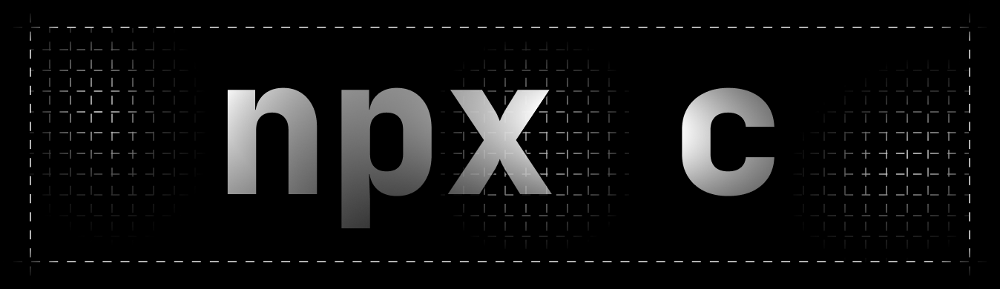
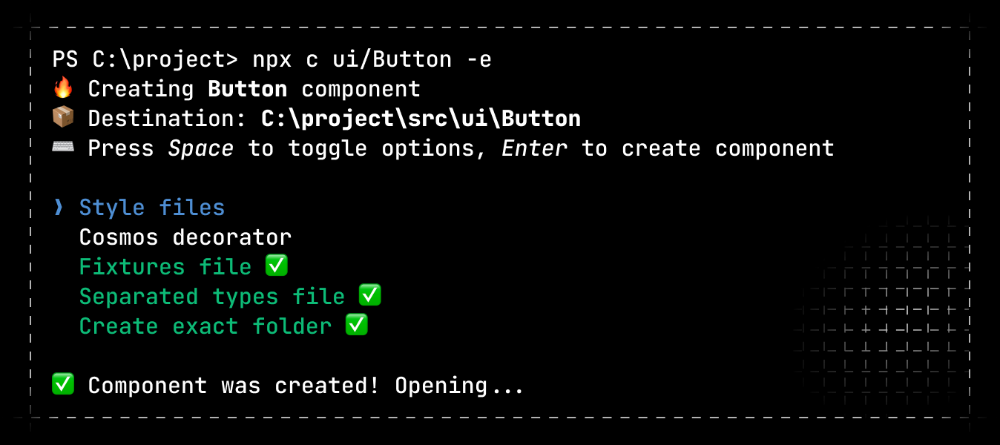

<p align="center">
  
  <h1 align="center">
    ⚡ Bootstrap React component folder structure
  </h1>
</p>

CLI for bootstraping component folder structure for TypeScript React projects that use SCSS Modules for styling and [React Cosmos](https://github.com/react-cosmos/react-cosmos#readme) for visual testing

### Install

```sh
npm i -D @lr0pb/component
```

### Using

Use `npx c` to create component in the current working directory:

```
$ npx c ui/Button
            |
            v
src/ui/components/Button
```

It uses the next pattern for the component path:

```
$ npx c [folders]/[name]
               |
               v
[sourceDir]/[folders]/components/[name]
```

You could switch source directory by `--source-dir [dir]` flag and you could remove adding nested `components/` folder by `--exact-path` (`-e`) flag

### Component file structure

Using next flags you could tweak what files will have your next component:

```
  -s, --styles        Style files (default: false)
  -d, --decorator     Cosmos decorator (default: false)
  --no-fixture        Fixtures file
  --no-types          Separated types file
  -e, --exact-path    Create exact folder (default: false)
```

All them you can apply via multi select interface:

<p align="center">
  
</p>

Use `-y` flag to create component immediatelly without operating with select interface

Component have next file structure:

```
Button
  ├ Button.tsx                 base file
  ├ Button.fixture.tsx         --no-fixture to opt out
  ├ Button.module.scss         --styles
  ├ Button.module.scss.d.ts    --styles
  ├ Button.types.ts            --no-types to opt out
  ├ cosmos.decorator.tsx       --decorator
  └ index.ts                   base file
```

Types declaration file for styles is the same you get from [Typed CSS Modules](https://www.npmjs.com/package/typed-css-modules) with `--namedExports` flag

Project was created using [Pastel](https://github.com/vadimdemedes/pastel#readme), [Ink](https://github.com/vadimdemedes/ink#readme), [Ink UI](https://github.com/vadimdemedes/ink-ui#readme) and [Zod](https://github.com/colinhacks/zod#introduction)
